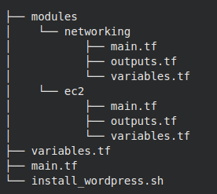

# terraform wordpress

Mini terraform project to deploy wordpress on AWS

- Create AWS secrets

```
export AWS_ACCESS_KEY_ID=XXXXXXXXXXXXXX
export AWS_SECRET_ACCESS_KEY=XXXXXXXXXXXXXXXXXXXXXXXXXXXXXX
```

- Create key-pair for EC2 instance

```
aws ec2 crate-key-pair --key-name devops --query "KeyMaterial" --output text > "$(pwd)/devops.pem"
```

- File structure




- We can initialize terraform
```
terraform init
```

- We can now apply configuration with the command

```
terraform apply -auto-approve
```

Check the resources on AWS

- To destroy and remove AWS resources

```
terraform destroy -auto-approve
```

